# My-Store Full-Stack

This project explains the fullstack application of the [StoreFront API](https://github.com/AlainD-/storefront-api) backend and the [My-Store](https://github.com/AlainD-/my-store) frontend.

## Backend

* Deployed url (Elastic Beanstalk): [http://storefrontapi-env-1.eba-xpkyym8v.us-east-1.elasticbeanstalk.com/](http://storefrontapi-env-1.eba-xpkyym8v.us-east-1.elasticbeanstalk.com/)

## Frontend

* Deployed url (S3 Bucket): [http://my-store-alaind.s3-website-us-east-1.amazonaws.com/](http://my-store-alaind.s3-website-us-east-1.amazonaws.com/)

## Important Notice

The backend and the frontend repositories are configured to automatically build and deploy on AWS with circleCI.
The instructions given here are to be used to manually trigger an automatic build and deployment of the full stack at once.

## Installation

* Clone the [StoreFront API](https://github.com/AlainD-/storefront-api) backend in the current directory
* Clone the [My-Store](https://github.com/AlainD-/my-store) frontend in the current directory
* Install the backend by running the command in the terminal: `npm run backend:install`
* Install the frontend by running the command in the terminal: `npm run frontend:install`

## Deploy

* Deploy backend by running the command in the terminal: `npm run backend:deploy`
* Deploy the frontend by running the command in the terminal: `npm run frontend:deploy`

## Documentation

Please refer to the specific sections for details information about:

* [Infrastructure Description](docs/INFRASTRUCTURE.md)
* [Pipeline Process](docs/PIPELINE.md)
* [Application Dependencies](docs/DEPENDENCIES.md)

The deployment proofs consist in screenshots located in the [screenshots](./screenshots) folder.

### RDS postgres database provisioned

* 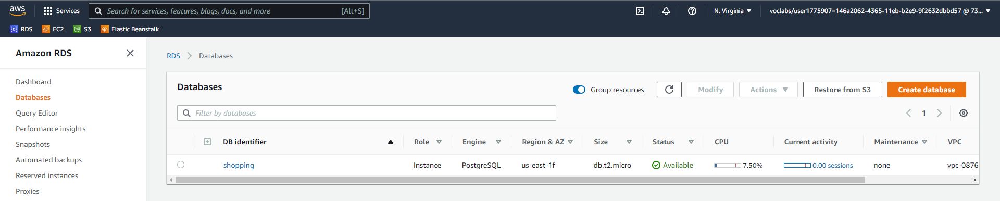
* 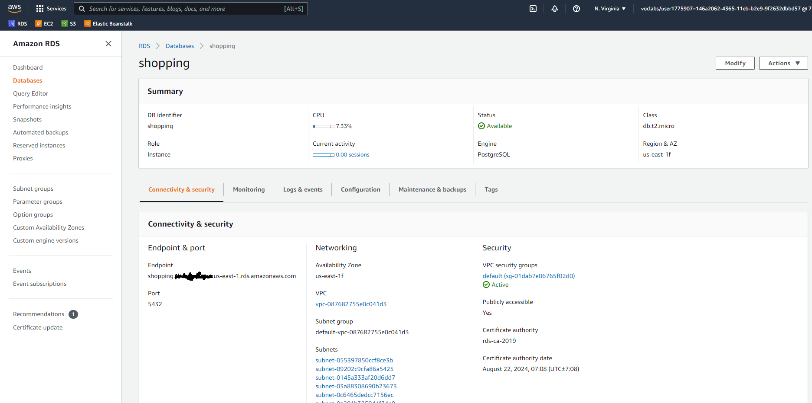
* 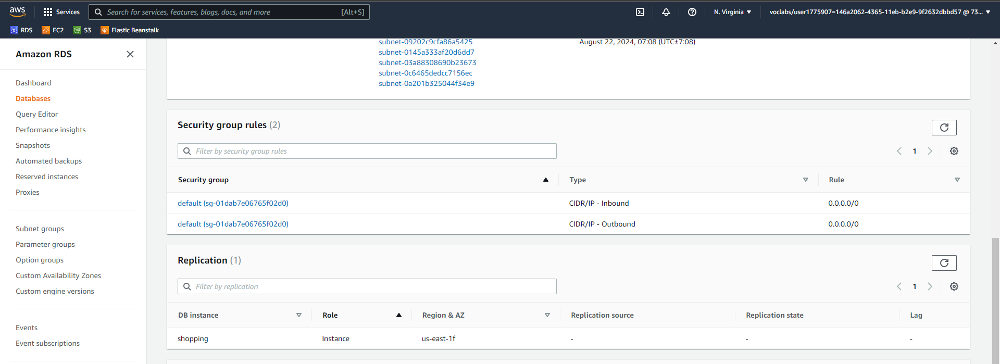

### Backend deployment in AWS Elastic Beanstalk

* AWS Beanstalk configuration
  * 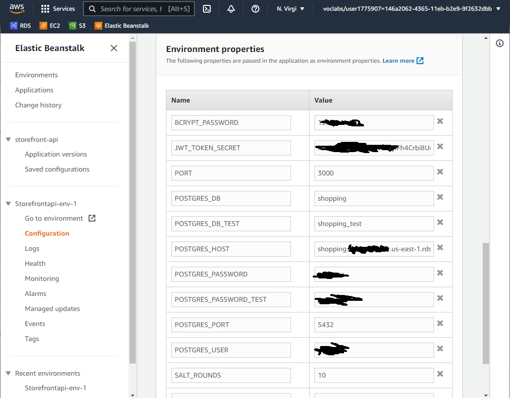
  * 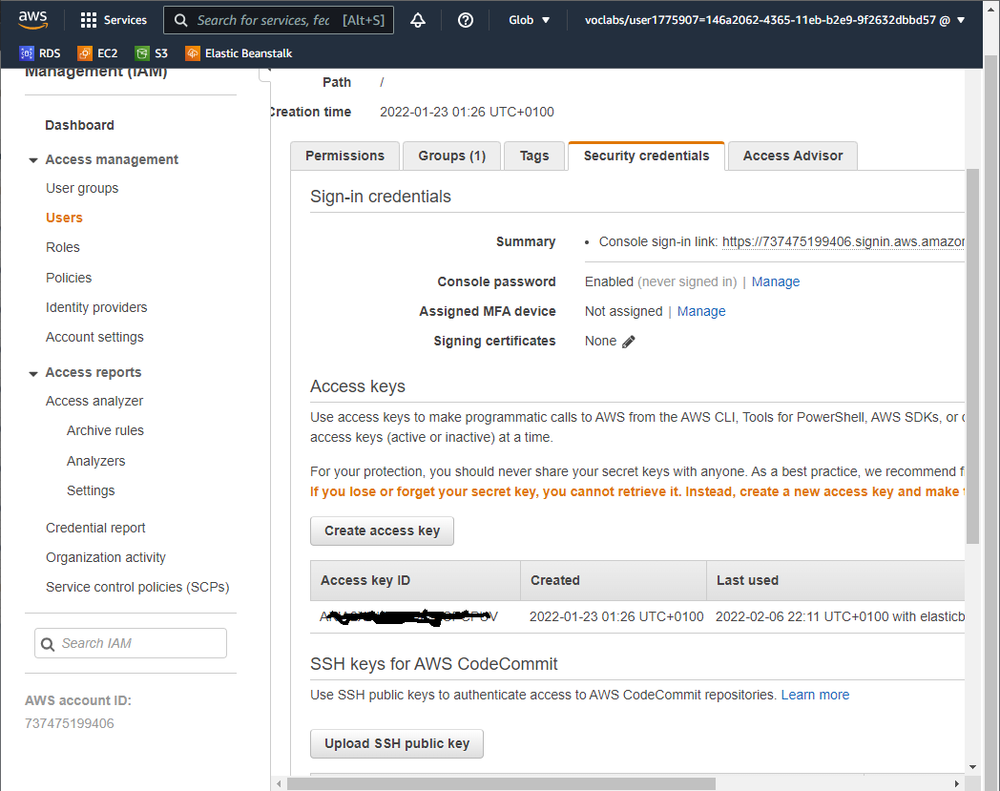
* CircleCI configuration
  * 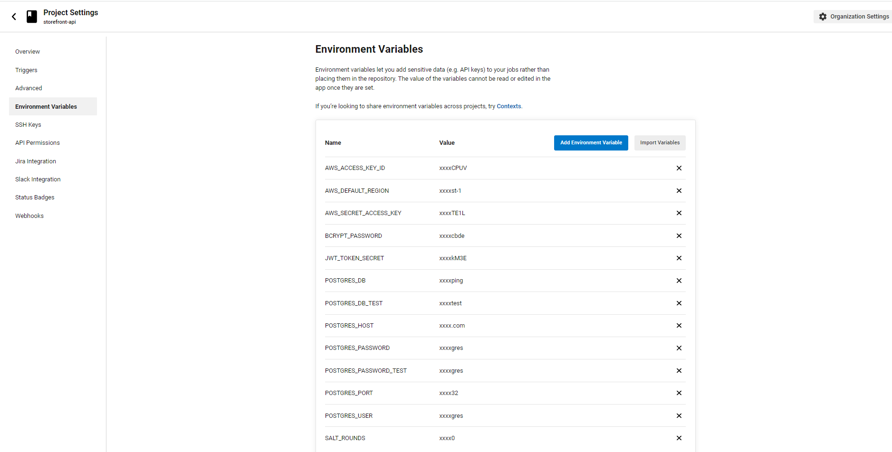
  * [.circleci/config.yml](https://raw.githubusercontent.com/AlainD-/storefront-api/master/.circleci/config.yml)
  * 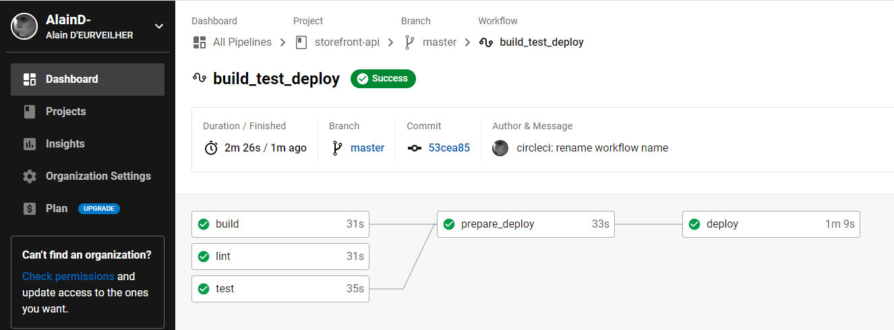
* Deployed successfully
  * 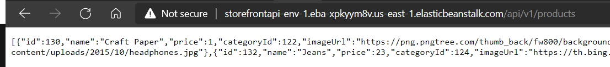
  * 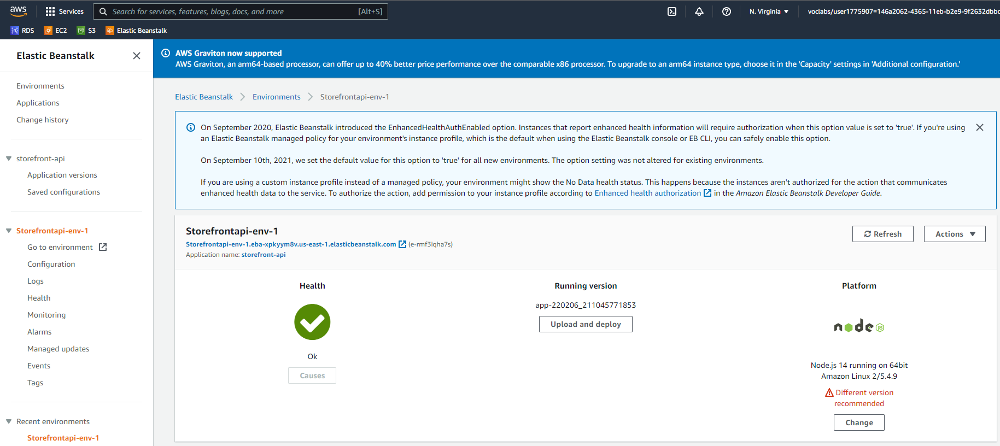
  * 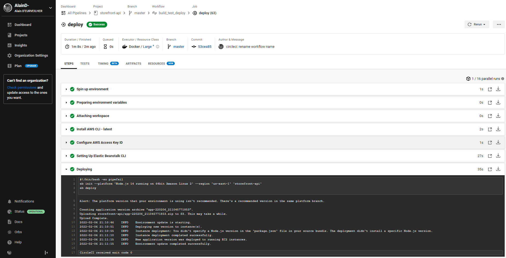
  * 
  * 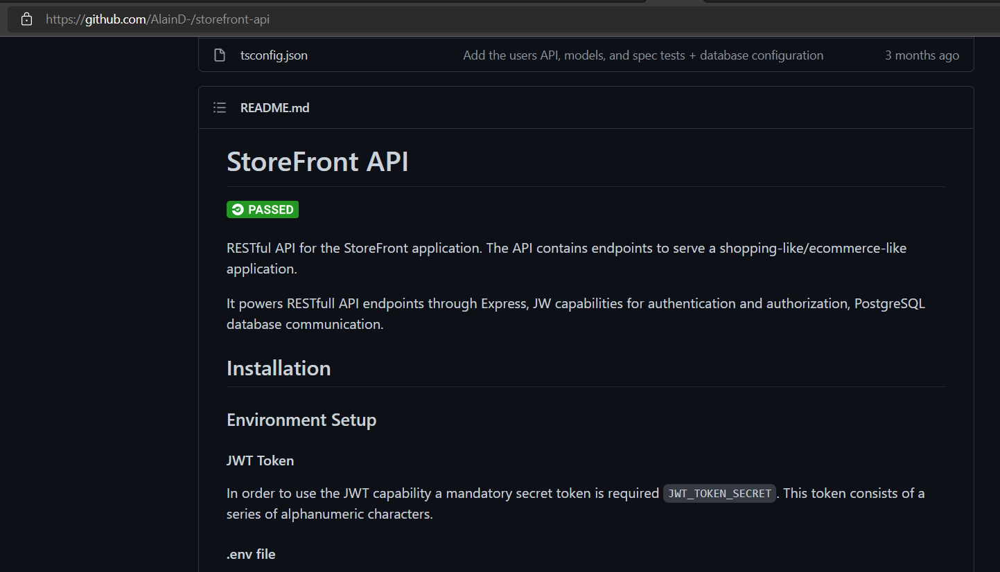

### Frontend deployment in AWS S3 bucket

* AWS S3 Bucket configuration
  * 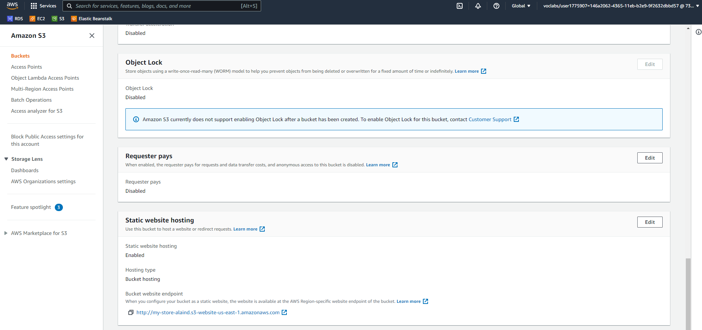
  * 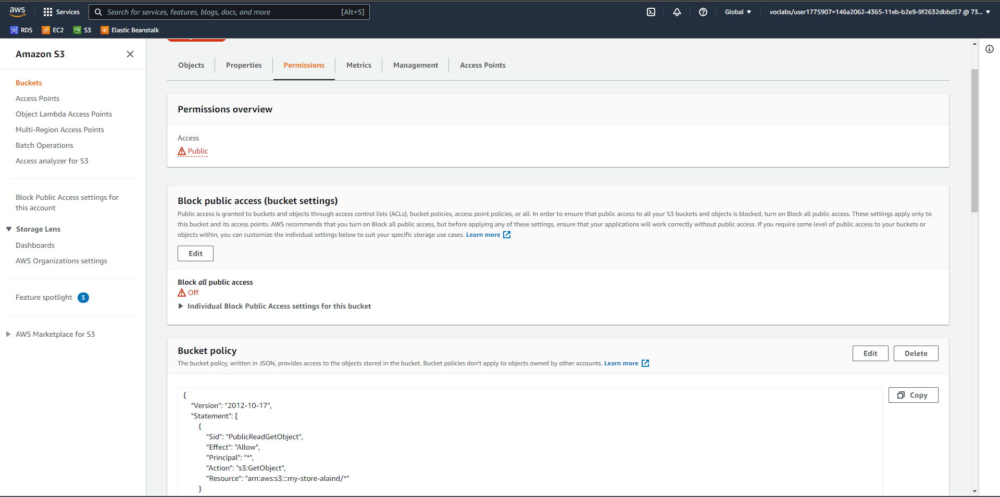
* CircleCI configuration
  * 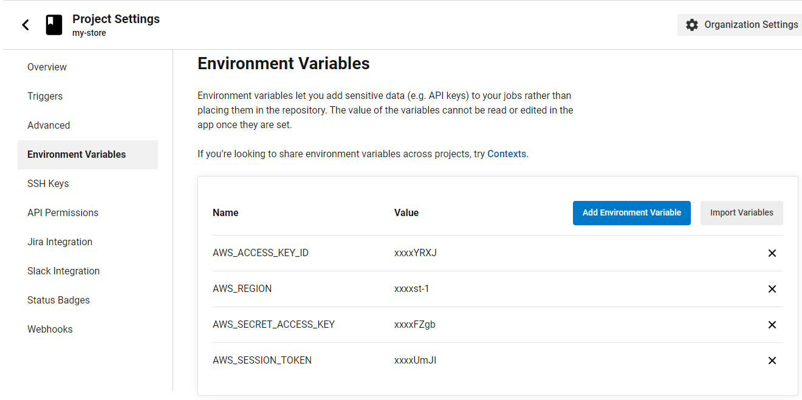
  * [.circleci/config.yml](https://raw.githubusercontent.com/AlainD-/my-store/master/.circleci/config.yml)
* Deployed successfully
  * 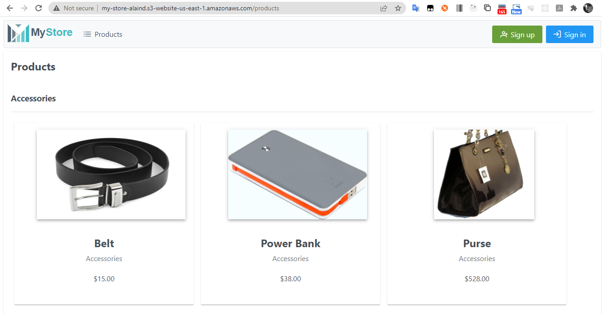
  * 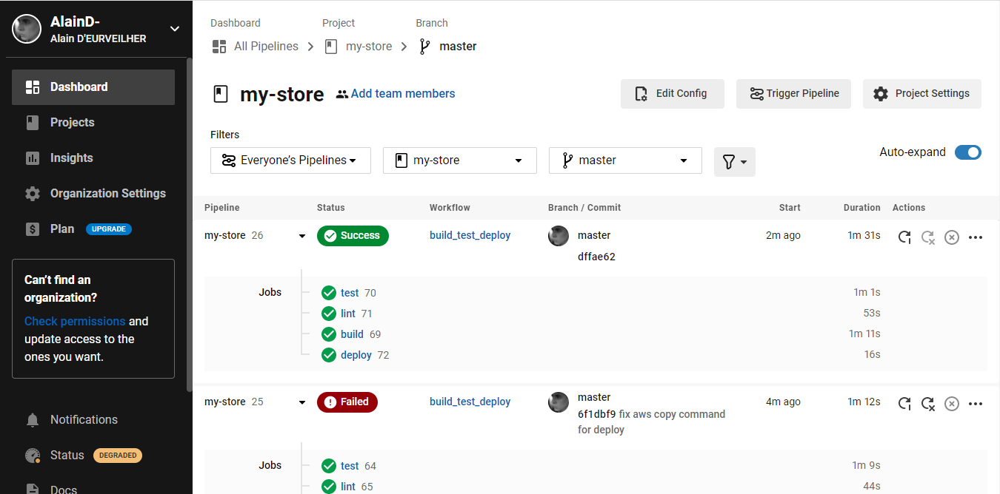
  * 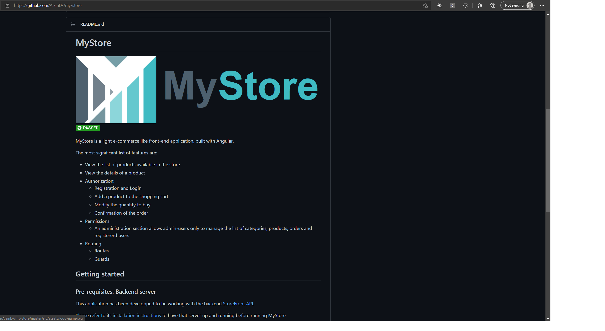

## License

[License](LICENSE)

## Authors

* **Alain D'EURVEILHER** - _Initial work_ - [AlainD.](https://github.com/AlainD-)
