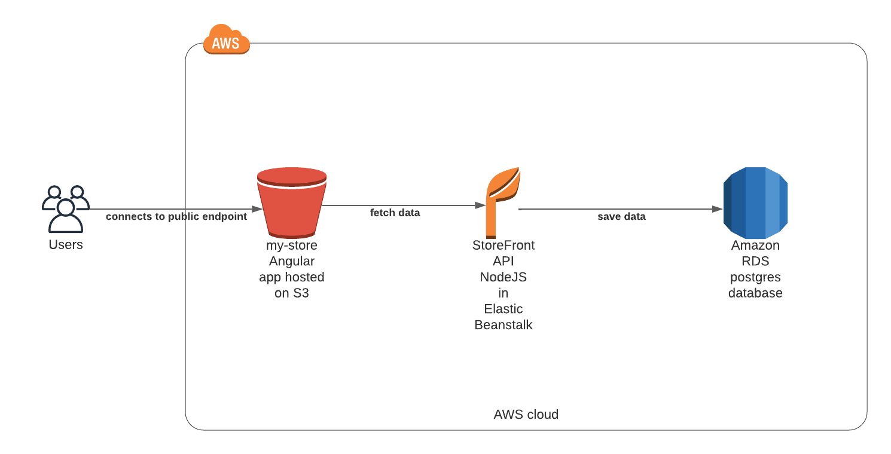

# Infrastructure

The following diagram describes the overall architecture of the whole application:

* A postgres relational database is hosted on the Amazon RDS service for the storage of the products, registered users and their orders.
* The NodeJS/express API application (backend) is deployed in the Amazon Elastic Beanstalk service.
* An IAM user credential is created to allow access to the Amazon Elastic Beanstalk and used to perform the deployment via the automatic deployment job of CircleCI during the continuous integration/continuous deployment process.
* The Angular web application (frontend) is deployed in an Amazon S3 bucket set as Web Hosting content.
* The web application communicates with the RESTful API via HTTP requests
